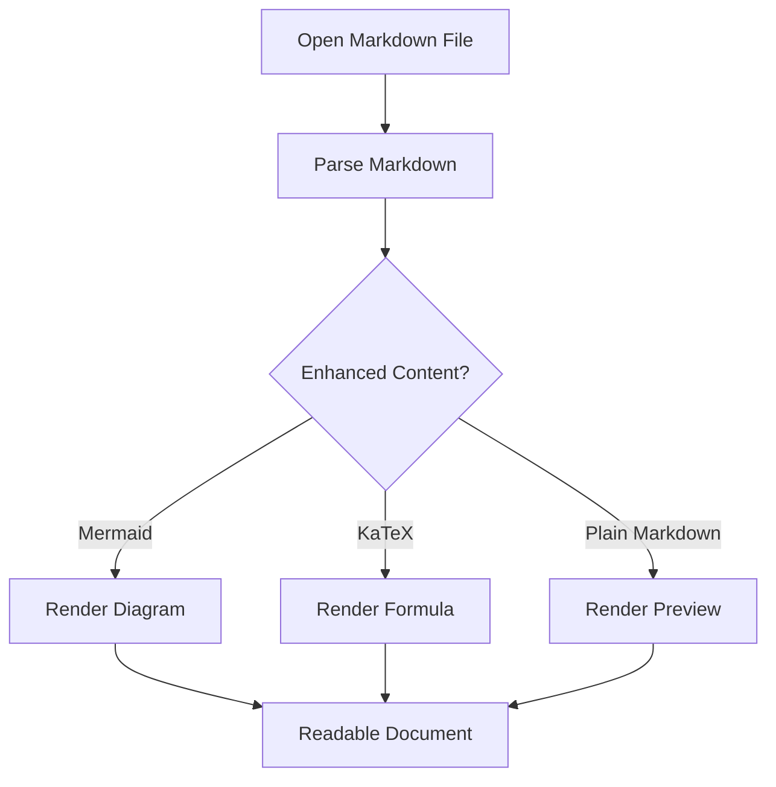

# MD Preview App Review Demo

This markdown file is provided for App Store Review. It is a self-contained sample that demonstrates the main document types MD Preview is designed to open: notes, task lists, tables, code blocks, Mermaid diagrams, KaTeX math, quotes, and GitHub-style alerts.

## Quick Review Instructions

1. Save this file to the Files app.
2. Open it with **MD Preview** using the iOS share sheet or the Files app's **Open In** action.
3. Scroll through the document to verify Markdown rendering, Mermaid diagrams, and KaTeX equations.

> [!NOTE]
> MD Preview is a local-first Markdown viewer. It does not require an account, server login, sample credentials, or network access to render local `.md` files.

## Product Planning Note

MD Preview is useful for quickly reading Markdown documents generated by coding assistants, note-taking apps, and developer tools.

### Review Checklist

- [x] Headings and nested sections
- [x] GitHub-style alert blocks
- [x] Tables with multiple columns
- [x] Fenced code blocks with syntax highlighting
- [x] Mermaid diagrams
- [x] KaTeX inline and display math
- [x] Task lists
- [x] Block quotes and links

## GitHub-Style Alerts

> [!TIP]
> Use MD Preview to open AI-generated plans, README drafts, and technical notes without launching an IDE.

> [!IMPORTANT]
> Mermaid diagrams and KaTeX formulas are rendered directly in the preview.

> [!WARNING]
> This sample intentionally includes wide tables and code blocks so reviewers can verify scrolling and layout behavior.

## Table Example

| Feature | Example Content | Expected Result | Review Notes |
|---|---|---|---|
| Heading rendering | `#`, `##`, `###` | Clear document hierarchy | Used throughout this file |
| Task lists | `- [x] Done` | Checkbox-style list items | See checklist above |
| Mermaid | Flowchart code fence | Rendered diagram | See Mermaid section |
| KaTeX | `$E = mc^2$` | Rendered math | See Math section |
| Code blocks | Rust and JavaScript snippets | Monospace highlighted code | See Code section |

## Code Blocks

```rust
fn main() {
    let title = "MD Preview";
    let files = ["README.md", "plan.md", "notes.md"];

    for file in files {
        println!("Open {file} with {title}");
    }
}
```

```javascript
const features = ["Markdown", "Mermaid", "KaTeX", "Tables"];
console.log(`Reviewing ${features.length} preview features`);
```

## Mermaid Diagram



## KaTeX Math

Inline math example: $E = mc^2$.

Display math example:

$$
\int_0^1 x^2\,dx = \frac{1}{3}
$$

Another formula commonly seen in technical notes:

$$
\text{score} = \frac{\text{completed tasks}}{\text{total tasks}} \times 100
$$

## Longer Reading Note

Markdown is often used for AI-generated documentation, engineering plans, meeting notes, and README drafts. A reviewer can use this file to verify that MD Preview opens a local Markdown file and presents the content in a readable, scrollable preview.

### Example Plan

1. Collect requirements.
2. Draft implementation notes.
3. Review diagrams and formulas.
4. Share the Markdown file through Files or another app.
5. Open the file in MD Preview for reading.

## Quote and Link

> Markdown keeps notes portable and easy to inspect.

Project website: https://vorojar.github.io/md-preview/

GitHub repository: https://github.com/vorojar/md-preview

